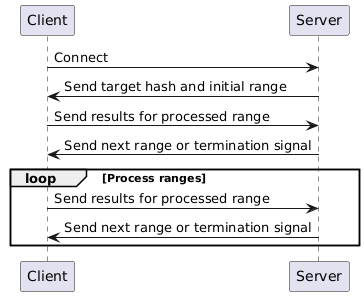

# Distributed MD5 Brute-Force

**Overview**

This repository implements a distributed MD5 brute-force system, leveraging multiple clients to efficiently search for a target MD5 hash.

**Protocol**

1. **Client Connection:**
   - The client establishes a TCP connection to the server.
2. **Target Hash and Initial Range:**
   - The server sends the target MD5 hash and an initial range of numbers to the client.
3. **Range Processing:**
   - The client processes the range of numbers, calculating the MD5 hash of each number.
   - If a match is found, the client immediately sends the result to the server and terminates.
4. **Result and Next Range:**
   - The client sends the processed range and any found matches to the server.
   - The server assigns a new range to the client or sends a termination signal if the hash is found or all ranges are exhausted.
5. **Loop:**
   - Steps 3 and 4 repeat until the hash is found or all ranges are processed.

**Communication Protocol (extras.py):**

- **send(socket, msg):**
  - Encodes the message length as a string.
  - Appends an exclamation mark (`!`) as a delimiter.
  - Sends the encoded message length and the actual message over the socket.
- **recv(socket):**
  - Receives the message length from the socket.
  - Receives the actual message based on the received length.
  - Decodes the message and returns it.